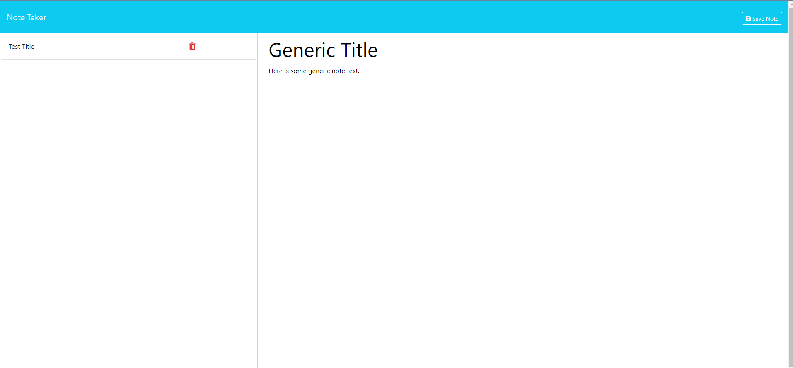
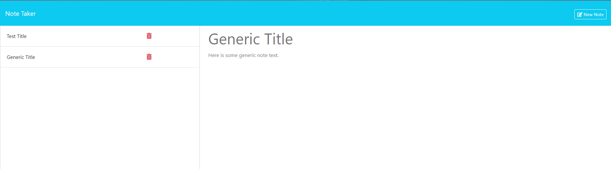

# note-app
A note taking application

## Table of Contents

- [Installation](#installation)
- [Usage](#usage)
- [Dependencies](#dependencies)
- [License](#license)

## Installation

1. Clone the repository:

    ```bash
    git clone https://github.com/yourusername/svg-maker.git
    cd svg-maker
    ```

2. Install the dependencies:

    ```bash
    npm install
    ```

## Usage

To run the application, execute the following command in your terminal:
```
    node server.js
```
# Access the Application

Open your web browser and navigate to http://localhost:3000. This should load the landing page of your note-taking application.

# Using the Application

To use the application, enter your note title and text like so: 



Then you can hit the save icon to save your note:


Your note should appear on the side for your review. You can add as many notes as you like, and delete notes using the trash can icon: 




## Dependencies

express: For creating the server and handling routing.

uuid: For generating unique IDs for notes.

## License

This project is licensed under the MIT License.
